# Space Fodder

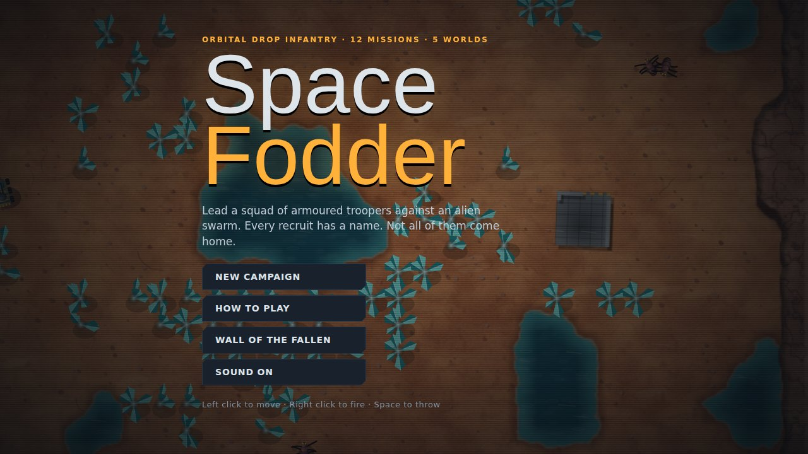

A top-down squad shooter in the spirit of the classic 1993 genre-definer *Cannon Fodder*. You lead a line of armoured drop troopers across alien worlds and try to bring as many of them home as you can. The enemy is an insectoid alien swarm.

Everything in the game is original and generated in code: art, sound, music, names and missions. No assets from any existing game or film are used. The rules are retro, but the rendering is modern:
- pseudo-3D cliffs with cast shadows
- dynamic lighting on night missions and bioluminescent flora
- blood, scorch marks and footprints that stay on the ground
- particle explosions and weather
- a dropship that flies the squad in and out

<table>
<tr>
<td>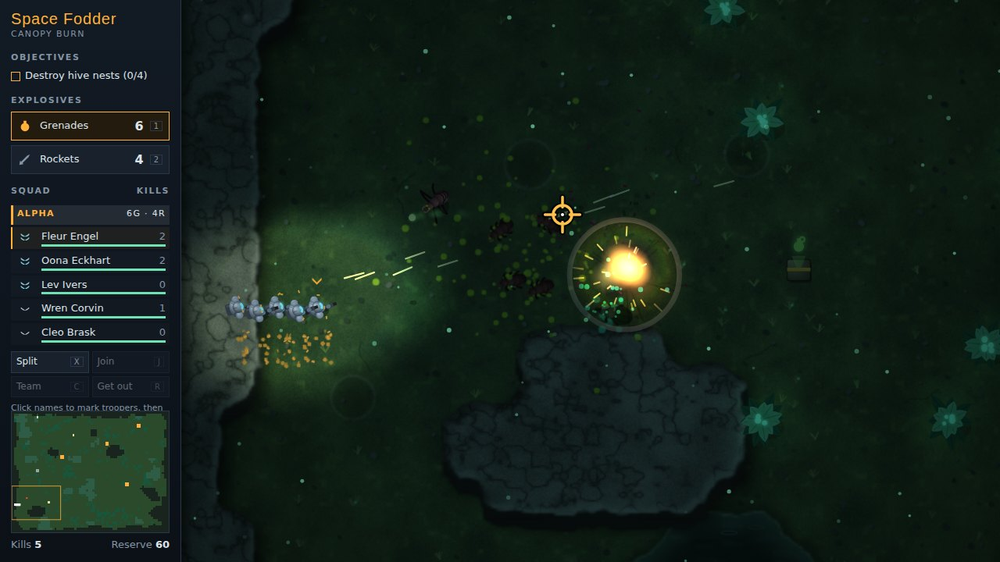</td>
<td>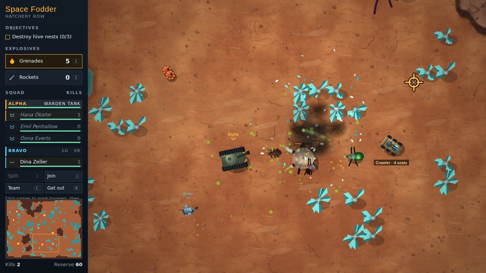</td>
</tr>
<tr>
<td align="center"><sub>Night drop on Veyra Prime. A grenade lands in the middle of the pack.</sub></td>
<td align="center"><sub>Alpha team drives the Warden tank while Bravo covers on foot. The Crawler waits for a crew.</sub></td>
</tr>
<tr>
<td>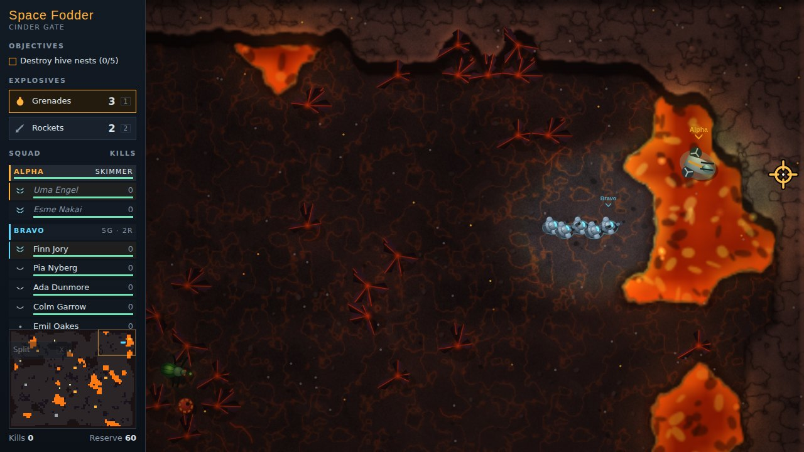</td>
<td>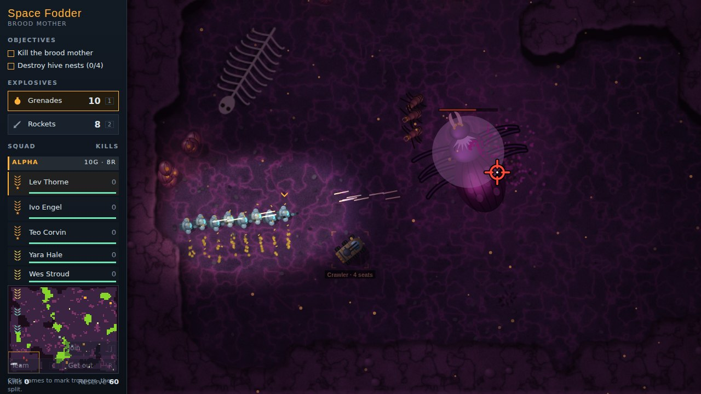</td>
</tr>
<tr>
<td align="center"><sub>The Skimmer is the only way across the lava fields of the Maw of Tehl.</sub></td>
<td align="center"><sub>The final mission: the brood mother, at the heart of the hive.</sub></td>
</tr>
</table>

## Play

There is no build step. Open `index.html` in a browser, or serve the folder:

```sh
npx serve .
```

Progress is saved in your browser's localStorage.

## Controls

| Input | Action |
| --- | --- |
| Left click / hold | Move the squad. Troopers follow the leader in a line. |
| Right click / hold, or `F` | Every trooper fires at the cursor. |
| `Space`, `E`, middle click, or both buttons | The leader throws a grenade or fires a rocket at the cursor. |
| `1` / `2`, `Q` or `Tab` | Choose grenades or rockets. |
| Click names in the squad list, then `X` | Split the marked troopers into a new team (up to three). With nothing marked, the team splits in half. |
| `C`, or click a team name | Command another team. Teams you are not commanding hold position and shoot back. |
| `J` | Join the team standing next to you. |
| Click a vehicle | The team walks over and climbs in if there are enough seats. `R` gets out. |
| `Esc` / `P` | Pause. `M` mutes. |
| Ctrl + click | Fire, for one-button trackpads. |
| Touch | Tap to move. Fire and Bomb auto-aim at the nearest threat. Team, Split and Out buttons manage teams and vehicles. |

---

# Field manual

The figures below come straight from the game code. Rifle rounds do 12 damage.

## Your troopers

<table>
<tr>
<td width="240">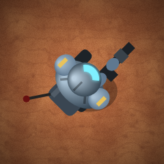</td>
<td>

**Drop trooper.** Powered armour, a rifle, and a name. Troopers can't shoot while wading, and grenades hurt them as much as they hurt aliens.

Rank makes a trooper better at everything. Each rank adds:
- +10 health (a recruit starts at 100)
- slightly faster movement and fire rate
- a tighter spread and a longer range

Rank shows as the stripe on the shoulder pads and the chevrons in the squad list.

</td>
</tr>
<tr>
<td width="240">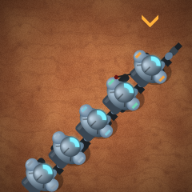</td>
<td>

**The squad.** Troopers walk in single file behind the leader, who is marked with a chevron. When the leader falls, the next trooper takes over. You can split the squad into up to three teams: Alpha (amber), Bravo (cyan) and Charlie (rose). Each team has its own leader, route and share of the explosives.

</td>
</tr>
</table>

| Rank | Short | | Rank | Short | | Rank | Short |
| --- | --- | --- | --- | --- | --- | --- | --- |
| Recruit | RCT | | Corporal | CPL | | Lieutenant | LT |
| Private | PVT | | Sergeant | SGT | | Captain | CPT |
| Lance Corporal | LCP | | Staff Sergeant | SSG | | Major | MAJ |

Survivors go up one rank after every successful mission. The dead are replaced from a reserve of 60 recruits. When the reserve and the barracks are both empty, the campaign is lost.

## The swarm

<table>
<tr>
<td width="200" align="center">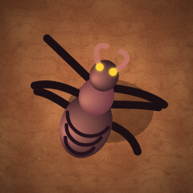<br><b>Skitter</b></td>
<td width="200" align="center">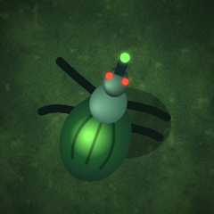<br><b>Spitter</b></td>
<td width="200" align="center">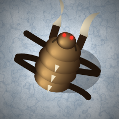<br><b>Brute</b></td>
</tr>
<tr>
<td valign="top">Fast pack hunter that closes in on a zig-zag. It dies to a single rifle round, but there are always more.<br><sub>12 health · bite 20</sub></td>
<td valign="top">Keeps its distance and lobs acid that splashes everyone nearby. It stops to spit, and that's the moment to shoot it.<br><sub>38 health · acid 26 · range 300</sub></td>
<td valign="top">Slow armoured bruiser that charges when it sees you. Its claws knock troopers back. Use rockets, shells or a well-placed grenade.<br><sub>260 health · claws 55</sub></td>
</tr>
<tr>
<td width="200" align="center">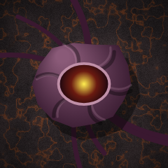<br><b>Hive nest</b></td>
<td width="200" align="center">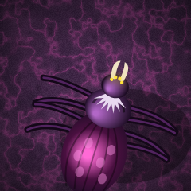<br><b>Brood mother</b></td>
<td width="200" align="center">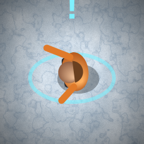<br><b>Colonist</b></td>
</tr>
<tr>
<td valign="top">Hatches aliens every few seconds while troopers are nearby. Rifle rounds bounce off its hide, so only explosives break it.<br><sub>120 health · explosives only</sub></td>
<td valign="top">The final boss. She births skitters from her sac and sprays acid in a fan.<br><sub>2600 health</sub></td>
<td valign="top">Not an enemy. Walk a trooper up to a waving colonist and they join the back of that team's line. Get them into the beacon alive.</td>
</tr>
</table>

## Vehicles

Vehicles have a fixed number of seats, and a team only fits if it's small enough. Often that means splitting the squad first. Vehicles take 60% of incoming damage, smoke when badly hurt, and are patched up by medkits. When one is destroyed, the crew bails out into the blast. Over deep lava, there is nowhere to bail out to.

<table>
<tr>
<td width="200" align="center">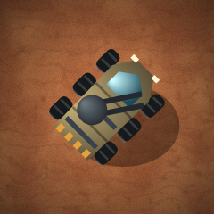<br><b>Crawler</b></td>
<td width="200" align="center">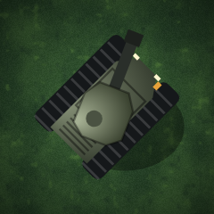<br><b>Warden tank</b></td>
<td width="200" align="center">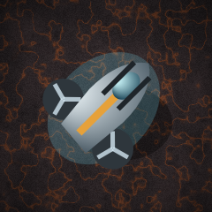<br><b>Skimmer</b></td>
</tr>
<tr>
<td valign="top">A fast buggy with a roof autocannon. It runs straight over skitters and spitters.<br><sub>4 seats · 320 armour · speed 175</sub></td>
<td valign="top">Slow and very tough. Its turret follows your cursor and fires explosive shells.<br><sub>3 seats · 850 armour · speed 88</sub></td>
<td valign="top">A hovercraft with twin guns. It crosses water, acid and lava.<br><sub>2 seats · 210 armour · speed 210</sub></td>
</tr>
</table>

## Field equipment

<table>
<tr>
<td width="200" align="center">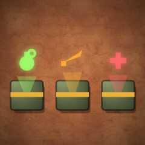<br><b>Supply crates</b></td>
<td width="200" align="center">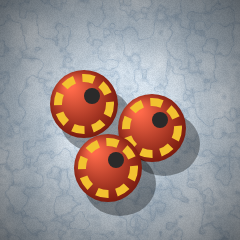<br><b>Fuel canisters</b></td>
<td width="200" align="center">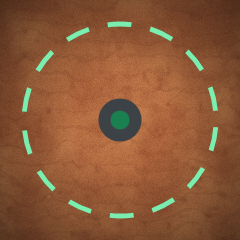<br><b>Extraction beacon</b></td>
</tr>
<tr>
<td valign="top">Walk or drive over a crate to pick it up:
<ul>
<li>grenades: +4</li>
<li>rockets: +3</li>
<li>medkit: +60 health for the whole team and 35% repair for its vehicle</li>
</ul>
Each crate goes to the team that finds it.</td>
<td valign="top">A canister explodes when shot, and nearby canisters go up with it. Lure the swarm close before you fire.</td>
<td valign="top">Where colonists are rescued and where the dropship picks you up. It lights up green once the extraction is open.</td>
</tr>
</table>

| Weapon | Blast radius | Damage |
| --- | --- | --- |
| Grenade (thrown, 1.3 s fuse, bounces) | 62 | 170 |
| Rocket (straight line, explodes on impact) | 58 | 190 |
| Tank shell | 58 | 210 |
| Fuel canister | 72 | 150 |

## Worlds

| | World | Missions | Hazards |
| --- | --- | --- | --- |
| 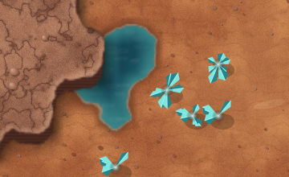 | **Kessik IV**<br>Arid dust world | 1–3 | Open ground and water holes. The last drop happens at dusk. |
| 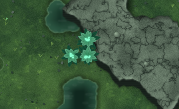 | **Veyra Prime**<br>Bioluminescent jungle | 4–6 | Thick flora blocks shots and paths, but grenades clear it. Dark at night. |
| 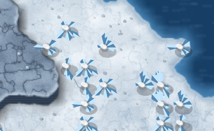 | **Ossur**<br>Frozen moon | 7–8 | Wide ice lakes, a blizzard and polar night. |
| 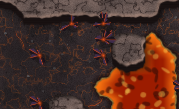 | **Maw of Tehl**<br>Volcanic badlands | 9–10 | Lava blocks troopers completely. Only the Skimmer can cross it. |
| 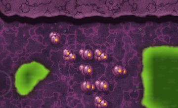 | **Vess**<br>Infested hive world | 11–12 | Acid pools burn through armour, and nests are everywhere. |

## The campaign

<table>
<tr>
<td>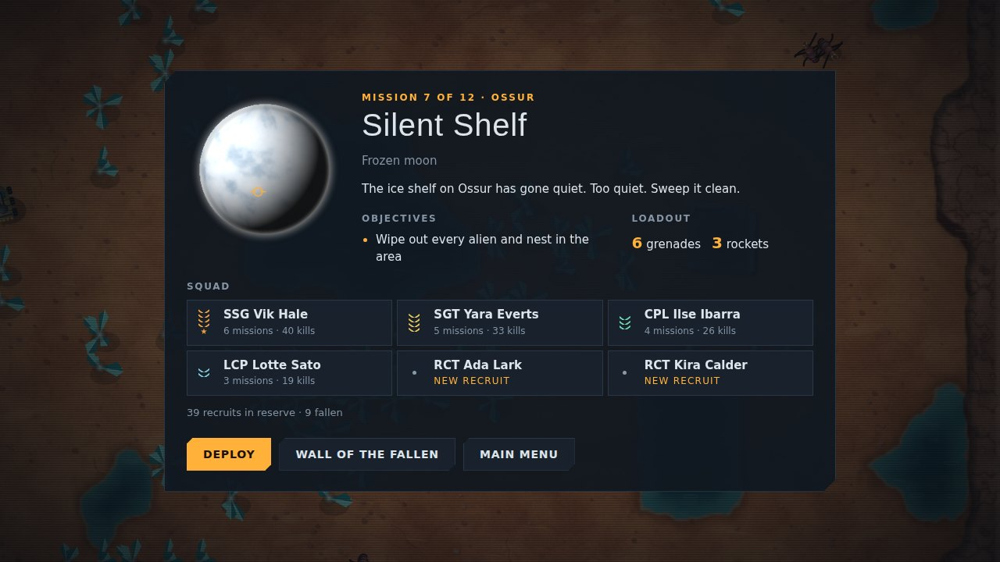</td>
<td>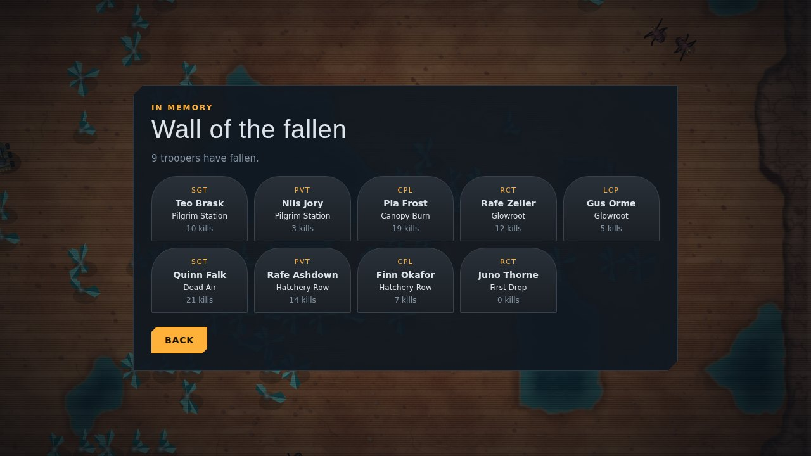</td>
</tr>
<tr>
<td align="center"><sub>Every mission starts with a briefing that shows your veterans and the fresh recruits filling the gaps.</sub></td>
<td align="center"><sub>The Wall of the Fallen remembers everyone who didn't come back.</sub></td>
</tr>
</table>

There are twelve missions across five worlds. Objectives include:
- wiping out all hostiles
- destroying hive nests
- escorting colonists to the beacon and extracting
- killing the brood mother

If a mission fails, you retry it with whoever survived.

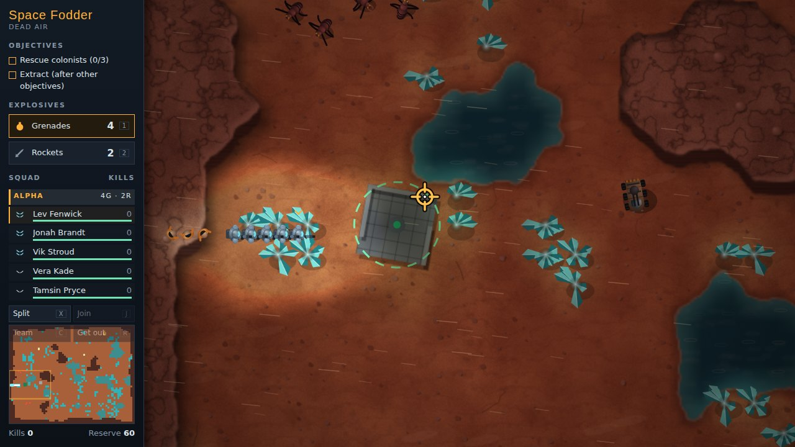

---

## Code layout

| File | Purpose |
| --- | --- |
| `js/util.js` | Math, seeded RNG, value noise, colour helpers, names and ranks |
| `js/input.js` | Mouse, keyboard and touch input |
| `js/audio.js` | Synthesised sound effects and a small music sequencer (Web Audio) |
| `js/terrain.js` | Biomes, procedural map generation, A* pathfinding, flow fields, terrain rendering |
| `js/sprites.js` | Vector drawing for troopers, aliens, nests, props and the dropship |
| `js/fx.js` | Particles and permanent decals |
| `js/entities.js` | Trooper, alien, nest and colonist classes and alien AI |
| `js/vehicles.js` | Vehicle stats and sprites |
| `js/world.js` | A mission in progress: teams, vehicles, weapons, objectives, rendering and lighting |
| `js/missions.js` | Campaign data |
| `js/game.js` | Screens, HUD, camera, persistence and the main loop |
| `tools/readme-images.js` | Regenerates the images in `docs/images` |

The game is plain browser JavaScript loaded with classic `<script>` tags, so it also runs from `file://`.

### Regenerating the README images

The screenshots are staged scenes captured with Playwright. The unit portraits are drawn with the game's own sprite functions.

```sh
npm install --no-save playwright
npx playwright install chromium
node tools/readme-images.js
```

## A note on teams

Teams you are not commanding hold position and return fire. I chose that for this game; I don't know for certain how idle squads behaved in the original.
